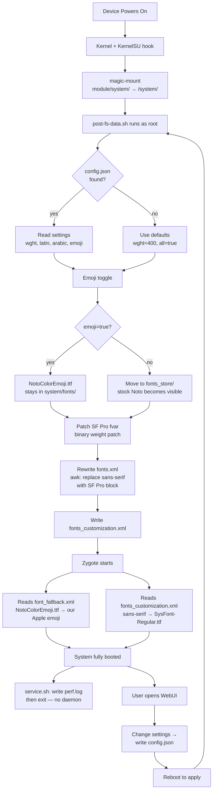

# Apple Fonts & Emoji — Architecture & How It Works

> **This is a learning document.** I wrote it for you specifically — not just a dry spec, but a real explanation of *why* every decision was made, what traps we fell into, and how we debugged them. Read this like a story, not a manual.

---

## Table of Contents

1. [The big picture — what this module does](#1-the-big-picture)
2. [How Android loads fonts — the foundation](#2-how-android-loads-fonts)
3. [The boot sequence — when our code runs](#3-the-boot-sequence)
4. [KernelSU magic-mount — the core trick](#4-kernelsu-magic-mount)
5. [The files in this module](#5-the-files-in-this-module)
6. [post-fs-data.sh — the heart of the module](#6-post-fs-datash)
7. [Binary patching — editing a font file in place](#7-binary-patching-the-font-weight)
8. [The emoji bug — a debugging story](#8-the-emoji-bug)
9. [OEM compatibility — why Samsung and Xiaomi need special treatment](#9-oem-compatibility)
10. [The WebUI — how settings persist across reboots](#10-the-webui)
11. [What we learned — lessons for future projects](#11-lessons-learned)

---

## 1. The Big Picture

```
┌─────────────────────────────────────────────────────────────┐
│                    WHAT THE USER SEES                        │
│                                                              │
│   App renders text          App renders emoji                │
│   "Hello"  ← SF Pro         😀 ← Apple Color Emoji          │
│   "مرحبا" ← SF Arabic       🫪 ← Apple (macOS 26)           │
└─────────────────────────────────────────────────────────────┘
                              ↑
              These files live here on the phone:
              /system/fonts/SysFont-Regular.ttf  (SF Pro)
              /system/fonts/NotoColorEmoji.ttf   (Apple emoji)
              /system/fonts/SF-Arabic.ttf        (SF Arabic)
                              ↑
              But /system is READ-ONLY (erofs partition).
              We can't write there directly.
                              ↑
              KernelSU magic-mount OVERLAYS our files
              on top of the real /system — without modifying it.
```

The entire module is built on one insight: **Android reads font files from `/system/fonts/` at boot. If you control what files are there, you control what every app renders.** We never touch the real system partition — we just project a shadow over it.

---

## 2. How Android Loads Fonts

### The chain of config files

Android uses several files to tell its text engine (Minikin) which fonts to use. On Android 16:

```
font_fallback.xml         ← THE real config. Minikin reads this first.
    ↓ (references filenames like NotoColorEmoji.ttf, Roboto.ttf)
fonts_customization.xml   ← OEM/module overrides for named families
    ↓ (can add or replace families like "sans-serif")
fonts.xml                 ← DEPRECATED. Kept for app compatibility only.
    ↓ (apps that parse this file directly still get correct info)
/system/fonts/*.ttf       ← The actual font files
```

**Key lesson we learned the hard way:** `fonts.xml` says at the top "DEPRECATED: This XML file is no longer a source of the font files installed in the system." We ignored that warning for too long and spent time injecting emoji into fonts.xml — which had zero effect because Minikin wasn't reading it for that purpose.

### How Minikin picks an emoji font

When you type 😀, Minikin does this:

```
1. Look up the Unicode codepoint (U+1F600)
2. Check font_fallback.xml for a family with lang="und-Zsye" (emoji script)
3. The first family listed is → NotoColorEmoji.ttf
4. Search for NotoColorEmoji.ttf in /system/fonts/
5. Load it and render the glyph
```

Step 4 is where we win: we put our Apple emoji there under that exact filename.

### Font table formats

There are several ways a font file can store color emoji:

| Format | Table name | Used by | Size |
|--------|-----------|---------|------|
| CBDT/CBLC | `CBDT` | Old Noto, our Apple emoji repack | ~115 MB |
| COLRv0 | `COLR` | New Noto (Android 16 stock) | ~2.8 MB |
| COLRv1 | `COLR` + `COLR ` | Newest emoji fonts | ~3-5 MB |
| sbix | `sbix` | Apple's native format (macOS/iOS) | ~50 MB |

The stock OxygenOS Android 16 uses **COLRv0** (vector, compact). Our Apple emoji is **CBDT** (bitmap, large). Android supports both — Minikin and Skia handle them the same way from the app's perspective.

---

## 3. The Boot Sequence

This is the most important concept in the module. **Timing matters enormously** — we have a very specific window to run our code.

```
┌─────────────────────────────────────────────────────────────────────┐
│                     ANDROID BOOT TIMELINE                            │
└─────────────────────────────────────────────────────────────────────┘

Power on
    │
    ▼
Bootloader → loads kernel
    │
    ▼
Kernel init → mounts partitions (/, /system, /data...)
    │
    ▼
init process starts
    │
    ├─→ KernelSU hooks in here (kernel-level)
    │       │
    │       └─→ magic-mount: our files overlay /system/fonts/
    │
    ▼
post-fs-data phase  ◄─── OUR CODE RUNS HERE (post-fs-data.sh)
    │   /data is mounted, /system is overlaid
    │   Root is available
    │   Zygote has NOT started yet ← critical
    │
    ▼
Zygote starts
    │   Reads font configs (font_fallback.xml, fonts_customization.xml)
    │   Loads font files into memory
    │   "Preloads" common classes and resources
    │   ← All apps fork from Zygote, so they inherit its font cache
    │
    ▼
system_server starts (System UI, PackageManager, etc.)
    │
    ▼
Boot completed  ◄─── service.sh runs here (after boot)
    │
    ▼
User unlocks screen — sees Apple fonts
```

**Why post-fs-data?** Because it's the only window where:
- `/data` is readable (we can read `config.json`)
- `/system` is overlaid (our fonts are visible)
- Zygote hasn't started (fonts aren't loaded yet into any process)

If we ran our code after Zygote starts, we'd be too late — the font cache is already built.

---

## 4. KernelSU Magic-Mount

This is what makes "systemless" possible. Here's how it actually works:

```
Real filesystem:          After magic-mount:
/system/fonts/            /system/fonts/
  Roboto.ttf       →        Roboto.ttf        (unchanged, from real /system)
  NotoColorEmoji.ttf →      NotoColorEmoji.ttf ← our 115 MB Apple emoji
  NotoSans*.ttf    →        NotoSans*.ttf     (unchanged)
  [missing]                 SysFont-Regular.ttf ← we added this
  [missing]                 SF-Arabic.ttf     ← we added this
```

KernelSU uses **OverlayFS** (a Linux kernel feature) to create this view. The real `/system` partition is never modified — it remains read-only erofs. But every process on the device sees the overlaid view.

The module directory structure mirrors the target:

```
/data/adb/modules/AppleFonts/
    system/
        fonts/
            NotoColorEmoji.ttf   ← appears at /system/fonts/NotoColorEmoji.ttf
            SysFont-Regular.ttf  ← appears at /system/fonts/SysFont-Regular.ttf
            SF-Arabic.ttf        ← appears at /system/fonts/SF-Arabic.ttf
        etc/
            fonts.xml            ← appears at /system/etc/fonts.xml
            fonts_customization.xml  ← appears at /system/etc/fonts_customization.xml
```

**The rule:** whatever you put in `system/` inside your module directory gets overlaid on the real `/system` at the matching path.

---

## 5. The Files in This Module

```
AppleFonts/
│
├── module.prop          ← Identity card: version, updateJson URL
├── customize.sh         ← Runs ONCE at install time
├── post-fs-data.sh      ← Runs on EVERY BOOT, before Zygote
├── service.sh           ← Runs after boot_completed
├── action.sh            ← Runs when user taps "Run" in KSU manager
├── uninstall.sh         ← Runs when module is uninstalled
│
├── system/
│   ├── fonts/           ← Font files (magic-mounted over /system/fonts/)
│   └── etc/
│       └── fonts_customization.xml  ← Static fallback for sans-serif
│
├── webroot/             ← WebUI files (HTML/CSS/JS, served by KSU WebView)
│   ├── index.html
│   ├── style.css
│   └── app.js
│
└── scripts/
    ├── debug.sh         ← Diagnostic script
    ├── apply.sh         ← Called by WebUI to save settings
    └── reset.sh         ← Called by WebUI to reset defaults
```

### module.prop — the identity card

```properties
id=AppleFonts                     # Unique ID, must not clash with other modules
name=Apple Fonts & Emoji          # Display name in KSU manager
version=v1.3.0
versionCode=130                   # Integer — KSU compares this for updates
author=Abdulkarim & M
description=...
updateJson=https://raw.githubusercontent.com/...  # KSU fetches this to check for updates
```

The `updateJson` field points to a JSON file on GitHub. KernelSU fetches it periodically and shows an update badge if `versionCode` in the JSON is higher than the installed one.

```json
{
  "version": "v1.3.0",
  "versionCode": 130,
  "zipUrl": "https://github.com/.../releases/download/v1.3.0/AppleFonts-v1.3.0.zip",
  "changelog": "..."
}
```

---

## 6. post-fs-data.sh

This is the most important file. Let's walk through it section by section.

### Reading config

```sh
# Read config with safe fallbacks
WGHT=400; LATIN=true; ARABIC=true; EMOJI=true

if [ -f "$CONFIG" ]; then
  _W=$(grep -o '"wght":[0-9]*' "$CONFIG" | grep -o '[0-9]*$')
  [ -n "$_W" ] && WGHT=$_W
fi
```

**Why not use `jq`?** Because `jq` isn't guaranteed to exist on Android. We use `grep -o` with a regex pattern to extract values from JSON directly. It's ugly but reliable — this sh script runs on a minimal Android shell with very few tools available.

The pattern `'"wght":[0-9]*'` matches the literal string `"wght":` followed by digits. The second `grep -o '[0-9]*$'` extracts just the number at the end. This is a common pattern in Android shell scripting.

### Font toggles — moving files in/out of overlay

```sh
if [ "$EMOJI" = "false" ]; then
  [ -f "$FONTS/NotoColorEmoji.ttf" ] && mv "$FONTS/NotoColorEmoji.ttf" "$STORE/"
else
  [ -f "$STORE/NotoColorEmoji.ttf" ] && mv "$STORE/NotoColorEmoji.ttf" "$FONTS/"
fi
```

**How toggling works:** When a font is "disabled", we move the file OUT of the magic-mount directory (`system/fonts/`) into a private store (`fonts_store/`). KernelSU no longer overlays that filename, so the stock system file becomes visible again. To re-enable, we move it back.

This is elegant: we're using the filesystem itself as our toggle switch. No config files needed for the overlay layer — just file presence/absence.

### The awk transformation — rewriting fonts.xml

```sh
awk -v do_latin="$LATIN" -v wght="$WGHT" '
  { lines[NR] = $0 }          # Read all lines into array
  END {
    # Find the sans-serif family block
    ss = 0; se = 0
    for (i = 1; i <= NR; i++) {
      if (!ss && lines[i] ~ /name="sans-serif"/) {
        for (j = i; j >= 1; j--)
          if (lines[j] ~ /<family/) { ss = j; break }
        for (k = i; k <= NR; k++)
          if (lines[k] ~ /<\/family>/) { se = k; break }
      }
    }
    # ... build SF Pro block and replace
  }
' /system/etc/fonts.xml > "$MOD_XML"
```

**Why awk?** The fonts.xml is a multi-thousand-line XML file. We need to find the `<family name="sans-serif">` block (which spans many lines), replace it with our SF Pro definition, and output the whole modified file. `awk` can read the entire file into memory (`lines[NR]`), do multi-pass analysis in the `END` block, and output the result — all in one command, with no external dependencies.

**The two-pass approach:**
- Pass 1 (reading): `{ lines[NR] = $0 }` — store every line
- Pass 2 (in `END` block): scan for start/end of the block we want to replace, then output the modified version

This pattern (read all, then process in END) is standard awk for multi-line transformations.

**The SF Pro block we build:**

```awk
sf = "  <family name=\"sans-serif\">\n"
for (n = 1; n <= 9; n++) {
  wv = (w[n] == 400) ? wght : w[n]      # Only weight-400 gets user's choice
  sf = sf "    <font weight=\"" w[n] "\" style=\"normal\">SysFont-Regular.ttf"
  sf = sf "<axis tag=\"wght\" stylevalue=\"" wv "\"/>"
  # ...
}
sf = sf "  </family>"
```

SF Pro is a **variable font** — one font file that contains all weights. The `<axis>` tags tell Android which weight value to request. The user's slider sets `wght` (e.g., 300 for Light), which we inject here for the weight-400 slot (the "default" text weight).

---

## 7. Binary Patching the Font Weight

This is one of the most interesting parts technically.

### The problem

SF Pro is a variable font. Its `fvar` table (Font Variations table) stores the **default value** for each axis. When Android loads the font without specifying a weight, it uses the default from `fvar`.

We want the default weight to be what the user chose (e.g., 300 = Light), not 400. We could do this in fonts.xml, but we also need it as the actual font default — for apps that load fonts by name without specifying weight axes.

### The solution: in-place binary patch

```sh
patch_fvar_default() {
  local FONT="$1" AXIS_TAG_HEX="$2" NEW_VAL="$3"

  # Step 1: Read number of tables from font header (bytes 4-5, big-endian)
  N=$(_hex2dec "$(_rbytes "$FONT" 4 2)")

  # Step 2: Scan table directory for "fvar" tag (hex: 66766172)
  while [ "$i" -lt "$N" ]; do
    BASE=$((12 + i * 16))
    if [ "$(_rbytes "$FONT" "$BASE" 4)" = "66766172" ]; then
      FVAR_OFF=$(_hex2dec "$(_rbytes "$FONT" $((BASE + 8)) 4)")
      break
    fi
    i=$((i + 1))
  done

  # Step 3: Inside fvar, scan axis records for "wght" (hex: 77676874)
  # Step 4: At offset +8 into the axis record, write the new Fixed 16.16 value
  _write_fixed16 "$FONT" "$DEF_OFF" "$NEW_VAL"
}
```

**What is Fixed 16.16 format?** OpenType stores floating-point axis values as 32-bit integers where the upper 16 bits are the integer part and the lower 16 bits are the fractional part. For weight=300:

```
300 decimal = 0x012C hex
In Fixed 16.16: 0x012C0000
As bytes: 01 2C 00 00
```

Weight 400 (the default) is stored as:
```
400 = 0x0190 hex → 0x01900000
```

We find that byte sequence in the file and write `0x012C0000` in its place. This is *surgically* changing 4 bytes in a 25 MB font file — no font tools needed at runtime, just `dd` for reading and writing.

**Why `dd` and `od`?** These are the only byte-level I/O tools guaranteed on Android's minimal shell. `od -An -tx1` prints bytes as hex pairs. `dd bs=1 skip=N count=4` reads 4 bytes from an offset.

---

## 8. The Emoji Bug — A Debugging Story

This section documents the real debugging process. Understanding bugs is as important as writing features.

### Timeline of the emoji problem

```
v1.0.0: Module ships NotoColorEmoji.ttf (actually Noto renamed)
        User reports: "emoji is Android"
        We assumed: APEX was shadowing our file

v1.1.0: We renamed to AppleColorEmoji.ttf
        Logic: "if the file has a unique name, APEX can't shadow it"
        User reports: "ALL emoji now Android, even worse"
        What actually happened: We removed the NotoColorEmoji overlay,
        exposing the stock 2.8 MB COLRv0 Noto. Apps no longer saw
        even the old Noto — they saw this tiny new version.

v1.2.0: Downloaded real Apple emoji (115 MB CBDT, samuelngs/apple-emoji-ttf)
        Named it AppleColorEmoji.ttf
        fonts.xml injection: AppleColorEmoji.ttf as first und-Zsye family
        User reports: "still Android emoji"
        What was happening:
          - AppleColorEmoji.ttf was in /system/fonts/ ✓
          - fonts.xml had it first ✓
          - But Minikin reads font_fallback.xml, not fonts.xml for primary config
          - font_fallback.xml references NotoColorEmoji.ttf, not AppleColorEmoji.ttf
          - The APEX doesn't have emoji fonts at all (com.android.i18n = ICU data only)
          - The stock system NotoColorEmoji.ttf (2.8 MB COLRv0) won every time

v1.3.0: Named the Apple emoji NotoColorEmoji.ttf
        Magic-mount overlays stock 2.8 MB with 115 MB Apple CBDT
        font_fallback.xml references NotoColorEmoji.ttf → finds our file
        User reports: "it works"
```

### What we learned about font_fallback.xml

The crucial discovery was that `font_fallback.xml` exists in `/system/etc/` and is the actual config Minikin reads. It's **root-only readable** (shell user gets "Permission denied"). That's why our debug script couldn't grep it.

We found it by:
1. Running `ls /system/etc/ | grep font` — showed three files: fonts.xml, fonts_customization.xml, **font_fallback.xml**
2. Checking permissions: `font_fallback.xml` was not world-readable
3. Observing that the stock `NotoColorEmoji.ttf` was 2.8 MB COLRv0 (not from APEX)
4. Realizing that if font_fallback.xml references NotoColorEmoji.ttf, and we name our file NotoColorEmoji.ttf, magic-mount delivers our file when font_fallback.xml is processed

### The APEX dead-end

We spent significant time on the theory that `com.android.i18n` APEX was serving emoji. This theory was wrong for this device:

```
$ find /apex/com.android.i18n -name "*.ttf" 2>/dev/null
(no output)

$ ls /apex/com.android.i18n/etc/
icu/  ...  (only ICU locale data, no fonts)
```

The com.android.i18n APEX on Android 16 / OxygenOS only contains ICU data (Unicode character properties, locale data). Emoji are served from `/system/fonts/` directly.

**Lesson:** Don't trust assumptions. Check the actual device. Our APEX theory was based on older Android versions where APEX *did* contain emoji. Android 16 reorganized this.

### The debug process

Every time emoji was wrong, we ran:

```bash
adb shell "ls -la /system/fonts/NotoColorEmoji* /system/fonts/Apple*"
adb shell "head -50 /system/etc/fonts.xml"
adb shell "cat /data/adb/AppleFonts/post-fs.log"  # (needs root)
```

These three commands told us:
1. What files are visible after magic-mount
2. What the fonts.xml overlay actually contains
3. What post-fs-data.sh did at boot

The debug.sh script automates all of this and more — it checks file sizes, table formats (CBDT vs COLR vs sbix), magic-mount verification, and GMS font overrides.

---

## 9. OEM Compatibility

Different Android manufacturers customize the font system heavily. Here's how we handle it.

### The problem with Samsung and Xiaomi

Stock Android's sans-serif is Roboto. Samsung replaces it with `SamsungSans`. Xiaomi uses `MiSans`. Their fonts.xml files reference completely different filenames.

Our `fonts_customization.xml` solves this for the `sans-serif` family:

```xml
<family customizationType="new-named-family" name="sans-serif">
  <font weight="400" style="normal">SysFont-Regular.ttf<axis tag="wght" stylevalue="300"/></font>
  <!-- all weights... -->
</family>
```

This tells Android: "the `sans-serif` family is now `SysFont-Regular.ttf`" — regardless of what it was before. Since Android always uses `sans-serif` as the system font family name, this works universally.

### The alias detection in customize.sh

Some apps and subsystems load fonts by **filename** directly (not by family name). This is technically wrong but common. For these, we need copies of SF Pro under the OEM's actual filenames.

```sh
# From customize.sh — runs at install time
awk '
  /name="sans-serif"/ { in_ss=1 }
  in_ss && /style="normal"/ {
    # Extract font filename from this line
    if (match($0, />[A-Za-z0-9._-]+\.ttf/))
      print substr($0, RSTART+1, RLENGTH-1)
  }
  in_ss && /<\/family>/ { in_ss=0; exit }
' /system/etc/fonts.xml | sort -u | while IFS= read -r OEM_FONT; do
  # Skip our own files and standard names
  case "$OEM_FONT" in
    SysFont*|Roboto*|NotoColor*|NotoNaskh*|SF-*|Geeza*|Cocon*) continue ;;
  esac
  # Create a copy of SF Pro under the OEM filename
  cp "$FONTS/SysFont-Regular.ttf" "$FONTS/$OEM_FONT"
done
```

**How it works:**
1. Parse the device's own `fonts.xml`
2. Find all font filenames referenced in the `sans-serif` family
3. Skip standard/known names
4. Copy SF Pro under every OEM filename found

On a Samsung device, this might create `SamsungSans-Regular.ttf` pointing to SF Pro. Any app that loads `SamsungSans-Regular.ttf` directly now gets SF Pro.

---

## 10. The WebUI

KernelSU has a built-in WebView that can serve files from a module's `webroot/` directory. This is how we provide a configuration UI without installing an app.

### Architecture of the settings system

```
User moves slider in browser
    │
    ▼ (WebUI JavaScript)
fetch('/api', { method: 'POST', body: JSON.stringify({wght: 300}) })
    │
    ▼ (KernelSU WebView API)
executes → scripts/apply.sh with parameters
    │
    ▼ (apply.sh)
writes → /data/adb/AppleFonts/config.json
    │
    ▼ (next reboot)
post-fs-data.sh reads config.json → applies settings
```

Settings are **not applied immediately** — they require a reboot. This is by design: font changes happen at the Zygote level, which means every process needs to restart (= reboot) to see the change.

### config.json structure

```json
{
  "wght": 300,        // font weight (100-1000)
  "wdth": 100,        // width axis (30-150, usually 100)
  "opsz": 28,         // optical size axis
  "latin": true,      // SF Pro enabled
  "arabic": true,     // SF Arabic enabled
  "geeza": false,     // Geeza Pro enabled
  "cocon": false,     // Cocon enabled
  "emoji": true       // Apple emoji enabled
}
```

This JSON lives in `/data/adb/AppleFonts/config.json`. It persists across reboots (it's on the `/data` partition which is encrypted but survives reboots). It's initialized with defaults at install time by `customize.sh`.

---

## 11. Lessons Learned

Here are the real takeaways from building this module — things no tutorial tells you.

### 1. "Deprecated" warnings are not just for apps

`fonts.xml` says "DEPRECATED" at the top. We assumed that meant "deprecated for apps to read." It actually means "deprecated as a system font config source." Minikin uses `font_fallback.xml` now. Always read the documentation at face value.

### 2. Debug with the real device, not assumptions

We theorized about APEX shadowing based on older Android documentation. The actual device had no APEX emoji at all. Half our debugging time was wasted on a theory that didn't apply. The right approach: `adb shell` → `ls`, `find`, `cat` → see what's actually there.

### 3. Check file permissions in your debug scripts

Our debug script couldn't read `font_fallback.xml` because it ran as the ADB shell user (not root). If a key diagnostic file is root-only, your debug script needs to run as root to be useful. We later made the debug script runnable via `su -c`.

### 4. File format matters as much as file name

We spent time worrying about the emoji filename (AppleColorEmoji vs NotoColorEmoji). The real issue was that the file we *thought* was Apple emoji was actually Google Noto renamed. Always verify file content:

```sh
# Check if a TTF is CBDT (color bitmap) or COLR (color vector)
dd if=font.ttf bs=1 count=4 | od -An -tx1  # check magic bytes
# Look for table tags in the sfnt table directory
```

### 5. Systemless modules are powerful but have timing constraints

The entire module depends on post-fs-data running at exactly the right time — after /data is mounted but before Zygote starts. If you miss this window (e.g., by using service.sh for something that needs to happen before fonts load), nothing works.

### 6. Shell scripting on Android is more constrained than on Linux

- No `jq` (parse JSON with grep/awk)
- No `python3` (do binary math with `dd` and `od`)
- `/bin/sh` might be toybox, mksh, or busybox — test for portability
- Some commands don't support all GNU flags (`stat -c%s` might not work everywhere — use `wc -c` as fallback)

### 7. The boot watchdog is essential

Without the 90-second self-disable, a buggy module could cause a permanent bootloop. The watchdog in `service.sh` saves users from having to manually disable via recovery. Always include this in any module that could affect boot.

---

## Architecture Diagram (Mermaid)



---

## Waterfall: Build → Install → Runtime

```
┌──────────────────────────────────────────────────────────────────┐
│  PHASE 1: BUILD (on developer's Linux PC)                         │
│  build.sh                                                         │
│  ─────────────────────────────────────────────────────────────── │
│  1. Extract SF Pro from Apple DMG (bsdtar + cpio)                 │
│  2. Extract SF Arabic from Apple DMG                              │
│  3. Validate emoji TTF (CBDT format, correct size)                │
│  4. Copy fonts to AppleFonts/system/fonts/ with correct names     │
│  5. Zip everything → AppleFonts-v1.3.0.zip                        │
└──────────────────────────────────────────────────────────────────┘
                              │
                              ▼ (user downloads and flashes)
┌──────────────────────────────────────────────────────────────────┐
│  PHASE 2: INSTALL (on device, runs once)                          │
│  customize.sh                                                     │
│  ─────────────────────────────────────────────────────────────── │
│  1. Check Android version (API 28+)                               │
│  2. Check free space (500 MB)                                     │
│  3. Validate all font files (magic bytes + size)                  │
│  4. Create device-specific filename aliases (OEM compat)          │
│  5. Copy fonts to WebUI directory                                 │
│  6. Initialize config.json with defaults                          │
│  7. Set correct permissions on all files                          │
└──────────────────────────────────────────────────────────────────┘
                              │
                              ▼ (on every reboot)
┌──────────────────────────────────────────────────────────────────┐
│  PHASE 3: RUNTIME (on device, every boot)                         │
│  post-fs-data.sh                                                  │
│  ─────────────────────────────────────────────────────────────── │
│  1. Read config.json                                              │
│  2. Toggle fonts (move in/out of overlay directory)               │
│  3. Binary-patch SF Pro fvar default weight                       │
│  4. Propagate weight patch to OEM aliases                         │
│  5. Rewrite fonts.xml overlay (sans-serif → SF Pro)               │
│  6. Write fonts_customization.xml                                 │
└──────────────────────────────────────────────────────────────────┘
                              │
                              ▼ (after boot, once)
┌──────────────────────────────────────────────────────────────────┐
│  PHASE 4: POST-BOOT (on device, every boot)                       │
│  service.sh                                                       │
│  ─────────────────────────────────────────────────────────────── │
│  1. Wait for sys.boot_completed                                   │
│  2. Write performance snapshot to perf.log                        │
│  3. Exit — no daemon left running                                 │
└──────────────────────────────────────────────────────────────────┘
```

---

*Document written as a learning guide for the module's developer. If you're reading this to understand how KernelSU font modules work, the most important concepts are: magic-mount, post-fs-data timing, and why font_fallback.xml is the real config on Android 16.*
